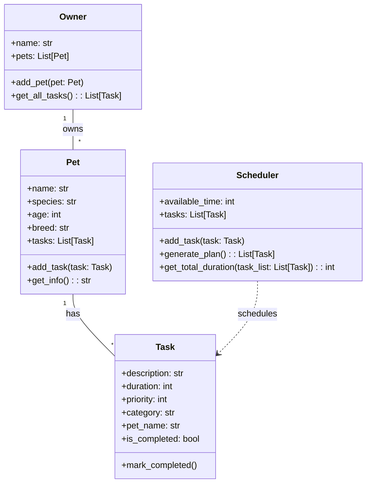

```mermaid
classDiagram
    class Owner {
        +name: str
        +pets: List[Pet]
        +add_pet(pet: Pet)
        +get_all_tasks(): List[Task]
    }

    class Pet {
        +name: str
        +species: str
        +age: int
        +breed: str
        +tasks: List[Task]
        +add_task(task: Task)
        +get_info(): str
    }

    class Task {
        +description: str
        +duration: int
        +priority: int
        +category: str
        +pet_name: str
        +is_completed: bool
        +mark_completed()
    }

    class Scheduler {
        +available_time: int
        +tasks: List[Task]
        +add_task(task: Task)
        +generate_plan(): List[Task]
        +get_total_duration(task_list: List[Task]): int
    }

    Owner "1" -- "*" Pet : owns
    Pet "1" -- "*" Task : has
    Scheduler ..> Task : schedules
```
